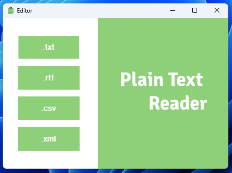
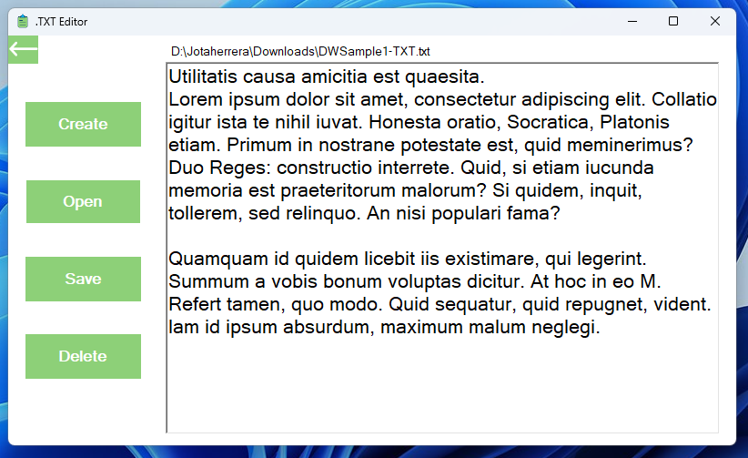
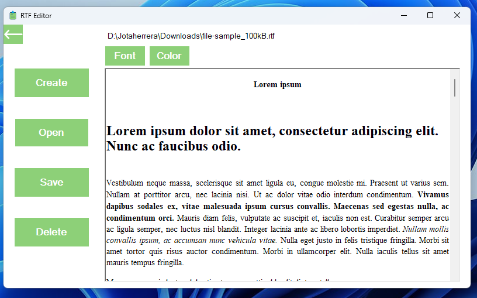
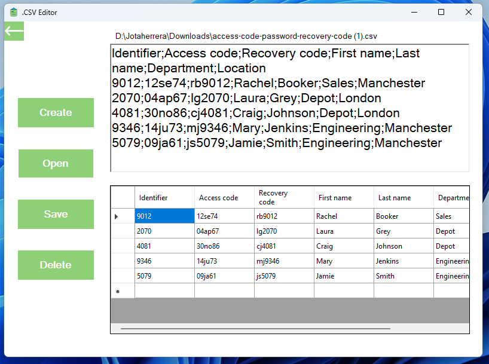
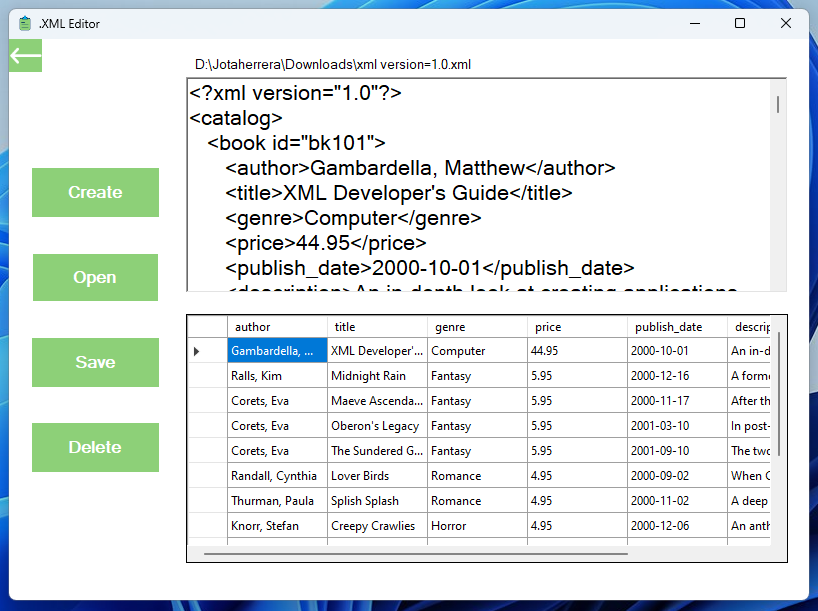

# Plain Text Reader

Plain Text Reader is a desktop application for Windows that allows users to edit and read plain text files in various formats, such as .txt, .csv, .rtf, and .xml. It is built using C# and the .NET Framework, and offers a simple and intuitive interface for managing plain text files. Whether you need to quickly edit a text file or browse through a CSV spreadsheet, Plain Text Reader has got you covered.

## Technologies used

- C# programming language
- .NET Framework
- Microsoft Visual Studio IDE

## Features

- Open and edit .txt, .csv, .rtf, and .xml files
- Save changes to existing files or create new ones
- Edit text and fields within a file
- Change font size and style (.rtf only)
- Change text color (.rtf only)
- Browse through the raw code of files

## Prerequisites

- Windows 10 or later
- .NET Framework 4.8 or later

## Installation

Clone or download this repository to your local machine.
Open the solution file (PlainTextReader.sln) in Microsoft Visual Studio.
Build the solution by clicking on the "Build" button in the Visual Studio toolbar.
Run the application by clicking on the "Start" button in the Visual Studio toolbar or by pressing the "F5" key.

That's it! The application should now be up and running on your local machine. If you encounter any issues during the installation process, create an issue in this repository.

## Screenshots

<section align="center">
    
    
    
    
    
</section>
